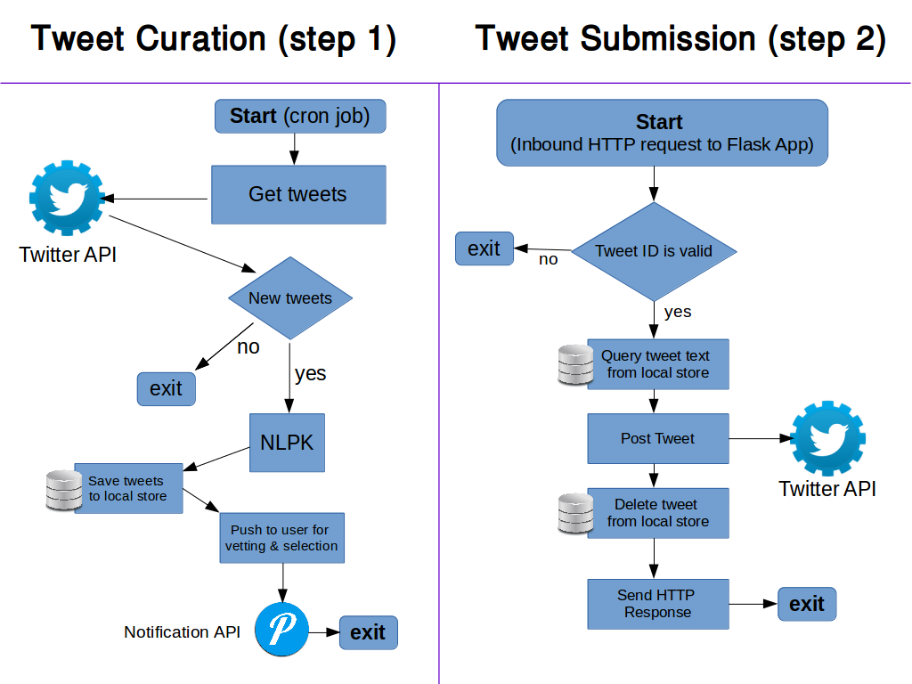

# twit-scrambler

### A Twitter bot that randomly scrambles and reposts a users' tweets



# Setup

Install Python Dependancies
```bash
$ pip install -r requirements.txt
```

Configure Twitter Creds
```bash
$ echo '{
    "consumer_key": "YOUR_TWITTER_CONSUMER_KEY",
    "consumer_secret": "YOUR_TWITTER_CONSUMER_SECRET_KEY",
    "access_token_key": "YOUR_TWITTER_ACCESS_TOKEN_KEY",
    "access_token_secret": "YOUR_TWITTER_ACCESS_TOKEN_SECRET"
}' > creds.json
```

Configure Tweet Sources
```bash
$ echo '[
    {"handle":"myTwitterHandle", "lookback":14, "tweets_to_mix":5, "mix_perc":0.65}
]' > twitter_accounts.json
```

Configure Flask Settings
```bash
$ echo '{
    "sqlite":"tweets.db",
    "port":8888,
    "host":"http://myhost.net:8888",
    "test_host":"http://127.0.0.1:8888"
}' > web_config.json
```

Configure Pushover Settings
```bash
$ echo '{
    "user_key":"YOUR_PUSHOVER_USER_KEY",
    "application_key":"YOUR_PUSHOVER_APPLICATION_KEY"
}' > pushover_creds.json
```

### Schedule Tweet Retrieval
Open cron
```bash
$ crontab -e
```
Add A New Job. Example Would Check For New Tweets At 5 Minute Intervals. Be Mindful Of Rate Limits.
```
*/5 * * * * cd ~/twit-scrambler/ && python3.6 twit_scrambler.py >> twitterout.log
```

### Launch Flask Application
```bash
$ nohup sudo python app.py & disown
```
